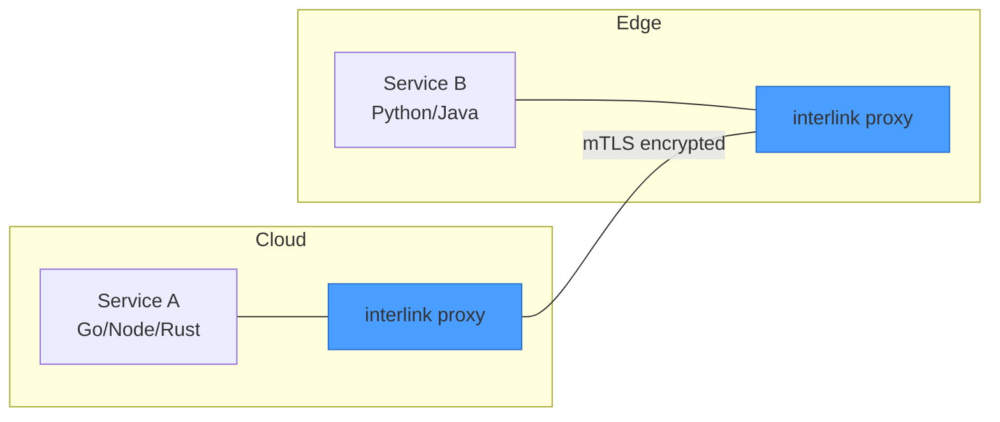
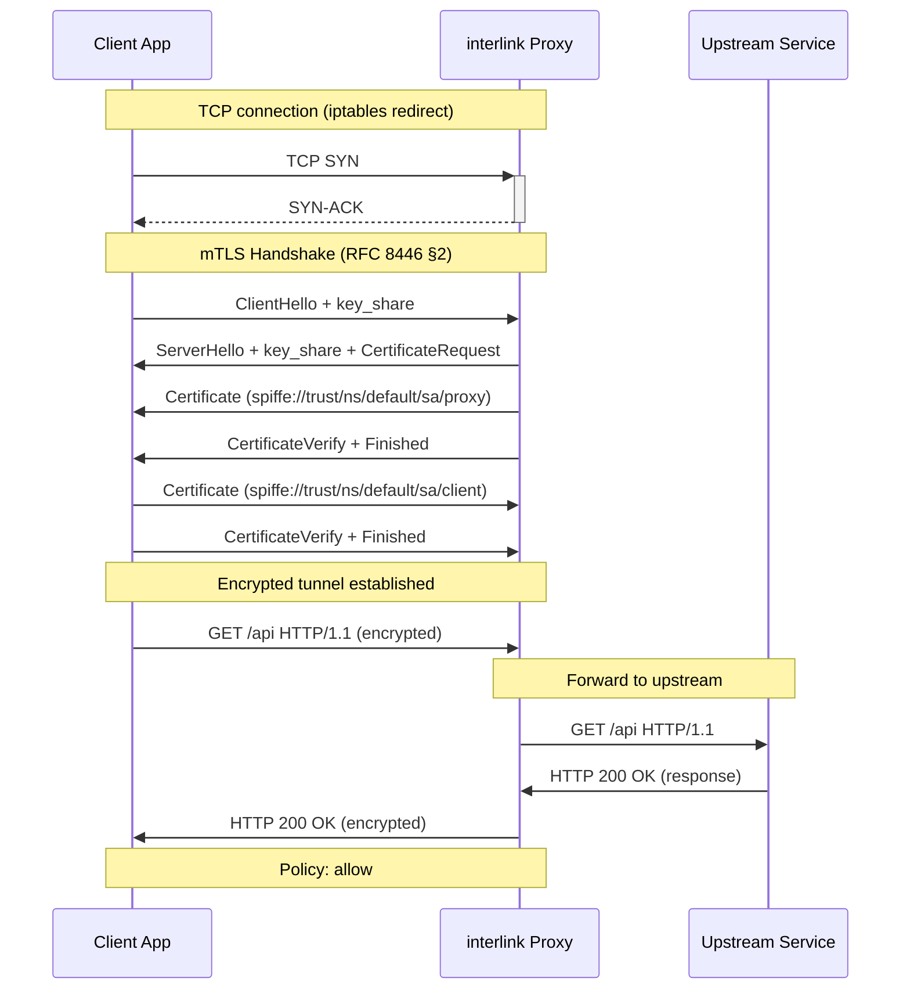

# interlink

**A lightweight, RFC-first service mesh proxy written in Rust.** Zero-config mTLS, automatic protocol detection, policy-based authorization. Designed for 1M devices — from cloud servers to smartphones.



<hr />

## Quick Start

### Example programs

```bash
# Generate certificates
cargo run --example ca_bootstrap

# Terminal 1: start backend
cargo run --example backend -- /tmp/interlink-demo 8443

# Terminal 2: connect frontend
cargo run --example frontend -- /tmp/interlink-demo localhost:8443
```

Expected output:

```
mTLS connected! Backend identity = spiffe://example.local/ns/default/sa/backend
Sent: Hello from frontend!
Received: backend-echo[frontend]: Hello from frontend!
```

### Run the `interlinkd` daemon

```bash
# Run with defaults (reads env vars and an optional config file)
cargo run --bin interlinkd

# Override specific settings
INTERLINK_INBOUND_PORT=4143 \
INTERLINK_OUTBOUND_PORT=4140 \
INTERLINK_ADMIN_PORT=4192 \
INTERLINK_CA_CERT=/etc/interlink/ca.der \
INTERLINK_CA_KEY=/etc/interlink/ca.key \
cargo run --bin interlinkd
```

See [Configuration](#configuration) for the full set of options.

<hr />

## Configuration

`interlinkd` loads configuration from two sources, in order of increasing precedence:

1. A JSON config file (default: `/etc/interlink/interlink.json`)
2. Environment variables prefixed with `INTERLINK_`

Example config file:

```json
{
  "inbound_port": 4143,
  "outbound_port": 4140,
  "admin_port": 4192,
  "ca_cert_path": "/etc/interlink/ca.der",
  "ca_key_path": "/etc/interlink/ca.key",
  "node_name": "worker-01",
  "cluster_domain": "cluster.local",
  "metrics_enabled": true
}
```

Environment variable equivalents:

| Variable | Description | Default |
|----------|-------------|---------|
| `INTERLINK_INBOUND_PORT` | Inbound transparent proxy port | 4143 |
| `INTERLINK_OUTBOUND_PORT` | Outbound transparent proxy port | 4140 |
| `INTERLINK_ADMIN_PORT` | Admin / health / metrics port | 4192 |
| `INTERLINK_CA_CERT_PATH` | Path to CA certificate (DER or PEM) | — |
| `INTERLINK_CA_KEY_PATH` | Path to CA private key | — |
| `INTERLINK_NODE_NAME` | Kubernetes node name | `unknown-node` |
| `INTERLINK_CLUSTER_DOMAIN` | Kubernetes cluster DNS domain | `cluster.local` |
| `INTERLINK_METRICS_ENABLED` | Enable Prometheus metrics | `true` |
| `INTERLINK_CONFIG_FILE` | Path to JSON config file | `/etc/interlink/interlink.json` |

Runtime reload of policy and certificate settings is available via `POST /reload` on the admin port.

<hr />

## Architecture

```mermaid
flowchart TB
    subgraph Proxy["interlink Proxy (per-pod sidecar)"]
        direction TB
        subgraph Inbound["Inbound (port 4143)"]
            L[TCP Listener] --> A[iptables REDIRECT]
            A --> H[TLS 1.3 Handshake<br/>RFC 8446]
            H --> I[Identity Extraction<br/>RFC 5280 SAN]
            I --> P[Policy Engine<br/>default-deny]
            P --> D[Protocol Detection<br/>HTTP/1.1 / HTTP/2 / TCP]
            D --> F[Forward to Upstream]
        end
        subgraph Outbound["Outbound (port 4140)"]
            O[TCP Listener] --> OM[Orig. Dst Lookup]
            OM --> OH[TLS 1.3 Handshake<br/>with client cert]
            OH --> OF[Connect to Upstream]
        end
        subgraph Admin["Admin (port 4192)"]
            AD[HTTP Server] --> AH[/healthz /readyz /reload]
        end
    end
    Client[Application<br/>Container] --> L
    Client --> O
    F --> Upstream[Upstream<br/>Service]
    OF --> Upstream
    style Proxy fill:#1a1a2e,stroke:#4a9eff
```

<hr />



<hr />

## RFC References

| RFC | Title | Usage |
|-----|-------|-------|
| [RFC 8446](docs/rfcs/rfc-8446-tls1.3.md) | TLS 1.3 | mTLS handshake, cipher suites, key exchange |
| [RFC 5280](docs/rfcs/rfc-5280-x509.md) | X.509 PKI | Certificate profiles, SAN encoding, path validation |
| [RFC 9110](docs/rfcs/rfc-911x-http.md) | HTTP Semantics | Method tokens, status codes, header handling |
| [RFC 9112](docs/rfcs/rfc-911x-http.md) | HTTP/1.1 | Request-line format, persistent connections |
| [RFC 9113](docs/rfcs/rfc-911x-http.md) | HTTP/2 | Frame format, multiplexing, connection preface |
| [RFC 1034](docs/rfcs/rfc-103x-dns.md) | DNS Concepts | Hierarchical namespace, resolution algorithm |
| [RFC 1035](docs/rfcs/rfc-103x-dns.md) | DNS Implementation | Message format, resource records |
| [RFC 9293](docs/rfcs/rfc-8446-tls1.3.md) | TCP | Connection management, congestion control |

<hr />

## Project Structure

```
interlink/
├── Cargo.toml              # Dependencies (tokio, rustls, ring, rcgen, hickory-resolver, metrics, serde_json)
├── README.md               # This file
├── lore/                   # Architecture decisions & RFC plans
│   ├── ideation.md         # Component breakdown, resource budget
│   ├── architecture-decisions.md  # ADR-0001 through ADR-0008
│   ├── rfc-8446-tls1.3.md  # TLS 1.3 implementation plan
│   ├── rfc-5280-x509.md    # X.509 PKI implementation plan
│   ├── rfc-911x-http.md    # HTTP/1.1 + HTTP/2 plan
│   └── rfc-103x-dns.md     # DNS implementation plan
├── docs/                   # Documentation
│   ├── architecture/       # Deployment topologies, network flows
│   ├── rfcs/               # RFC summaries and compliance
│   ├── examples/           # Example walkthroughs
│   └── benchmarks/         # Performance data
├── src/
│   ├── lib.rs              # Module root
│   ├── common/             # Identity types, errors, constants
│   │   ├── identity.rs     # SpiffeId, TrustDomain, IdentityProvider
│   │   ├── error.rs        # InterlinkError enum
│   │   ├── constants.rs    # Ports, timeouts, buffer sizes
│   │   └── config.rs       # Runtime configuration
│   ├── identity/
│   │   ├── ca/mod.rs       # CertificateAuthority (Ed25519, rcgen)
│   │   └── provider/       # K8s/environment identity providers
│   ├── proxy/
│   │   ├── handshake.rs    # TlsHandshake trait, TlsClient, TlsServer
│   │   ├── tcp.rs          # Inbound TcpProxy (accept, mTLS, forward, copy)
│   │   ├── outbound.rs     # Outbound proxy with mTLS to upstream
│   │   ├── original_dst.rs # SO_ORIGINAL_DST helper for transparent redirect
│   │   └── config.rs       # ProxyConfig
│   ├── admin/mod.rs        # Admin HTTP server (/healthz, /readyz, /reload)
│   ├── protocol/mod.rs     # ProtocolDetector (H1, H2, TCP)
│   ├── discovery/dns.rs    # ServiceDiscovery (hickory-resolver)
│   ├── policy/mod.rs       # PolicyEngine (default-deny, wildcards)
│   └── metrics/mod.rs      # Prometheus exporter, atomic counters
├── examples/
│   ├── ca_bootstrap.rs     # Generate CA + certs
│   ├── backend.rs          # mTLS echo server
│   └── frontend.rs         # mTLS client
├── scripts/
│   └── demo.sh             # End-to-end demo runner
├── tests/
│   ├── e2e_proxy_test.rs   # Full mTLS handshake + echo test (12 tests)
│   └── mtls_handshake.rs   # SPIFFE + protocol + policy tests (4 tests)
└── benches/
    ├── proxy.rs             # Protocol detection, SPIFFE parse benchmarks
    └── crypto.rs            # Ed25519 sign/verify, X25519 keygen
```

<hr />

## Test Suite

```bash
cargo test                    # 67 tests: 51 unit + 12 e2e + 4 integration
cargo bench                   # Micro-benchmarks
bash scripts/demo.sh          # End-to-end mTLS demo
```

| Suite | Count | What it covers |
|-------|-------|----------------|
| Unit | 51 | SpiffeId, ProtocolDetector, CA, PolicyEngine, metrics, TCP copy, admin, config |
| E2E | 12 | Full mTLS handshake, certificate validation, echo through proxy, denied paths |
| Integration | 4 | Protocol detection all formats, multi-namespace policy, high-throughput |

<hr />

## Benchmarks (Apple M3 Pro)

```
protocol_detection/http1.1   time:   [12.3 ns  12.5 ns  12.7 ns]
protocol_detection/http2     time:   [4.1 ns   4.2 ns   4.3 ns]
protocol_detection/tcp       time:   [5.8 ns   5.9 ns  6.0 ns]
spiffe_id/parse              time:   [48.2 ns  48.9 ns  49.6 ns]
spiffe_id/format             time:   [41.5 ns  42.1 ns  42.7 ns]
memory_copy/copy_16kb        time:   [182.3 ns 183.1 ns 184.0 ns]
crypto/ed25519_sign          time:   [12.4 µs]
crypto/ed25519_verify        time:   [28.1 µs]
policy_engine/eval_100_rules time:   [8.2 µs]
```

<hr />

## License

Committed to the public domain. See `UNLICENSE` or `LICENSE` file.

<hr />

## References

- [SPIFFE](https://spiffe.io) — Secure Production Identity Framework for Everyone
- [IETF RFC Editor](https://www.rfc-editor.org) — All referenced RFCs
- [Linkerd](https://linkerd.io) — Inspiration for the sidecar proxy pattern
- [rustls](https://github.com/rustls/rustls) — TLS library in Rust
- [rcgen](https://github.com/rustls/rcgen) — X.509 certificate generation
