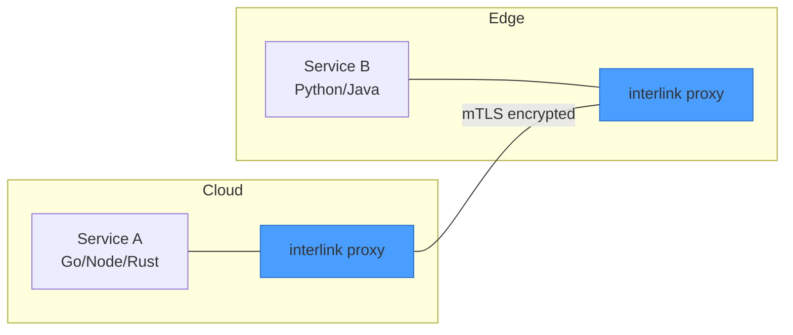

# interlink

**A lightweight, RFC-first service mesh proxy written in Rust.** Zero-config mTLS, automatic protocol detection, policy-based authorization, and ALPN-negotiated multiplexed tunnels that amortize the TLS handshake across all connections to a peer (−63 % proxy CPU under connection churn). Designed for 1M devices — from cloud servers to smartphones.



<hr />

## Quick Start

### Example programs

```bash
# Generate certificates
cargo run --example ca_bootstrap

# Terminal 1: start backend
cargo run --example backend -- /tmp/interlink-demo 8443

# Terminal 2: connect frontend
cargo run --example frontend -- /tmp/interlink-demo localhost:8443
```

Expected output:

```
mTLS connected! Backend identity = spiffe://example.local/ns/default/sa/backend
Sent: Hello from frontend!
Received: backend-echo[frontend]: Hello from frontend!
```

### Run the `interlinkd` daemon

```bash
# Run with defaults (reads env vars and an optional config file)
cargo run --bin interlinkd

# Override specific settings
INTERLINK_INBOUND_PORT=4143 \
INTERLINK_OUTBOUND_PORT=4140 \
INTERLINK_ADMIN_PORT=4192 \
INTERLINK_CA_CERT=/etc/interlink/ca.der \
INTERLINK_CA_KEY=/etc/interlink/ca.key \
cargo run --bin interlinkd
```

See [Configuration](#configuration) and the full [Quickstart Guide](docs/examples/quickstart.md) for the full set of options.

<hr />

## Configuration

For a step-by-step walkthrough, see the [Quickstart Guide](docs/examples/quickstart.md).

`interlinkd` loads configuration from two sources, in order of increasing precedence:

1. A JSON config file (default: `/etc/interlink/config.json`)
2. Environment variables prefixed with `INTERLINK_`

Example config file:

```json
{
  "inbound_port": 4143,
  "outbound_port": 4140,
  "admin_port": 4192,
  "ca_cert_path": "/etc/interlink/ca.der",
  "ca_key_path": "/etc/interlink/ca.key",
  "node_name": "worker-01",
  "cluster_domain": "cluster.local",
  "metrics_enabled": true
}
```

Environment variable equivalents:

| Variable | Description | Default |
|----------|-------------|---------|
| `INTERLINK_PROXY_INBOUND_PORT` | Inbound transparent proxy port | 4143 |
| `INTERLINK_PROXY_OUTBOUND_PORT` | Outbound transparent proxy port (0 disables) | 4140 |
| `INTERLINK_METRICS_PORT` | Prometheus metrics port | 4190 |
| `INTERLINK_TRUST_DOMAIN` | SPIFFE trust domain | `cluster.local` |
| `INTERLINK_IDENTITY` | This proxy's SPIFFE ID | derived |
| `INTERLINK_CA_BUNDLE_PATH` | CA bundle (DER or PEM) for peer validation | — |
| `INTERLINK_CERT_PATH` / `INTERLINK_KEY_PATH` | Leaf cert (DER or PEM) / key (PKCS#8 DER or PEM) | — |
| `INTERLINK_DEFAULT_UPSTREAM` | Fallback upstream when `SO_ORIGINAL_DST` is unavailable | — |
| `INTERLINK_MUX` | Offer multiplexed tunnels (ALPN `il/mux/1`) to peers | `true` |
| `INTERLINK_ACCEPTORS` | SO_REUSEPORT acceptor tasks per listener (1–16) | `min(cores,4)` |
| `INTERLINK_COPY_BUF_SIZE` | Relay copy buffer size in bytes (4 KiB–1 MiB) | `65536` |
| `INTERLINK_MAX_CONNECTIONS` | Per-proxy connection limit | 1024 |
| `INTERLINK_CONFIG_FILE` | Path to JSON config file | `/etc/interlink/config.json` |

`POST /reload` on the admin port atomically reloads the CA bundle, leaf certificate, and private key for new handshakes. A reload succeeds only when the files form a trusted, currently valid key pair with the configured SPIFFE identity; otherwise it returns `500` and preserves the last-known-good credentials. Existing TLS streams are uninterrupted.

For a Signet agent using its default shared-volume layout, point Interlink at the same files and set `INTERLINK_IDENTITY` to the SPIFFE ID derived from the agent's trust-domain, namespace, and service-account arguments:

```sh
INTERLINK_CA_BUNDLE_PATH=/var/run/interlink/ca-bundle.pem
INTERLINK_CERT_PATH=/var/run/interlink/identity/tls.crt
INTERLINK_KEY_PATH=/var/run/interlink/identity/tls.key
```

<hr />

## Architecture

For deployment topologies and detailed connection flows, see the [Architecture Overview](docs/architecture/overview.md) and [Key Management](docs/architecture/key-management.md) docs.

```mermaid
flowchart TB
    subgraph Proxy["interlink Proxy (per-pod sidecar)"]
        direction TB
        subgraph Inbound["Inbound (port 4143)"]
            L[TCP Listener] --> H[TLS 1.3 Handshake<br/>RFC 8446]
            H --> M{ALPN<br/>il/mux/1?}
            M -- yes --> Y[Serve yamux streams<br/>one tunnel, many conns]
            M -- no --> I
            Y --> I[Identity Extraction<br/>RFC 5280 SAN]
            I --> P[Policy Engine<br/>default-deny]
            P --> D[Protocol Detection<br/>HTTP/1.1 / HTTP/2 / TCP]
            D --> F[Forward to Upstream]
        end
        subgraph Outbound["Outbound (port 4140)"]
            O[TCP Listener] --> OM[Orig. Dst Lookup]
            OM --> OT{Mux tunnel<br/>to peer?}
            OT -- yes --> OS[Open stream<br/>no handshake]
            OT -- no --> OH[TLS 1.3 Handshake<br/>ALPN il/mux/1 + client cert]
            OH --> OF[Tunnel or 1:1 relay]
            OS --> OF
        end
        subgraph Admin["Admin (port 4192)"]
            AD[HTTP Server] --> AH["/healthz /readyz /reload"]
        end
    end
    Peer[Peer interlink<br/>proxy] -- mTLS --> L
    Client[Application<br/>Container] -- plaintext --> O
    F --> App[Local App<br/>Container]
    OF -- mTLS --> RemotePeer[Peer interlink<br/>proxy]
    style Proxy fill:#1a1a2e,stroke:#4a9eff
```



<hr />


<hr />

## RFC References

Detailed RFC compliance notes live in [`docs/rfcs/`](docs/rfcs/).

| RFC | Title | Usage |
|-----|-------|-------|
| [RFC 8446](docs/rfcs/rfc-8446-tls1.3.md) | TLS 1.3 | mTLS handshake, cipher suites, key exchange |
| [RFC 5280](docs/rfcs/rfc-5280-x509.md) | X.509 PKI | Certificate profiles, SAN encoding, path validation |
| [RFC 9110](docs/rfcs/rfc-911x-http.md) | HTTP Semantics | Method tokens, status codes, header handling |
| [RFC 9112](docs/rfcs/rfc-911x-http.md) | HTTP/1.1 | Request-line format, persistent connections |
| [RFC 9113](docs/rfcs/rfc-911x-http.md) | HTTP/2 | Frame format, multiplexing, connection preface |
| [RFC 1034](docs/rfcs/rfc-103x-dns.md) | DNS Concepts | Hierarchical namespace, resolution algorithm |
| [RFC 1035](docs/rfcs/rfc-103x-dns.md) | DNS Implementation | Message format, resource records |
| [RFC 9293](docs/rfcs/rfc-8446-tls1.3.md) | TCP | Connection management, congestion control |

<hr />

## Project Structure

```
interlink/
├── Cargo.toml              # Dependencies (tokio, rustls, ring, rcgen, hickory-resolver, metrics, serde_json)
├── README.md               # This file
├── lore/                   # Architecture decisions & RFC plans
│   ├── ideation.md         # Component breakdown, resource budget
│   ├── architecture-decisions.md  # ADR-0001 through ADR-0008
│   ├── rfc-8446-tls1.3.md  # TLS 1.3 implementation plan
│   ├── rfc-5280-x509.md    # X.509 PKI implementation plan
│   ├── rfc-911x-http.md    # HTTP/1.1 + HTTP/2 plan
│   └── rfc-103x-dns.md     # DNS implementation plan
├── docs/                   # Documentation
│   ├── architecture/       # Deployment topologies, network flows
│   ├── rfcs/               # RFC summaries and compliance
│   ├── examples/           # Example walkthroughs
│   └── benchmarks/         # Performance data
├── src/
│   ├── lib.rs              # Module root
│   ├── common/             # Identity types, errors, constants
│   │   ├── identity.rs     # SpiffeId, TrustDomain, IdentityProvider
│   │   ├── error.rs        # InterlinkError enum
│   │   ├── constants.rs    # Ports, timeouts, buffer sizes
│   │   └── config.rs       # Runtime configuration
│   ├── identity/
│   │   ├── ca/mod.rs       # CertificateAuthority (Ed25519, rcgen)
│   │   └── provider/       # K8s/environment identity providers
│   ├── proxy/
│   │   ├── handshake.rs    # TlsHandshake trait, TlsClient, TlsServer
│   │   ├── tcp.rs          # Inbound TcpProxy (accept, mTLS, forward, copy)
│   │   ├── outbound.rs     # Outbound proxy: mux tunnel pool + 1:1 fallback
│   │   ├── mux.rs          # Multiplexed mTLS tunnels (yamux over ALPN il/mux/1), per-peer tunnel pool
│   │   ├── verify.rs       # SpiffeServerVerifier: RFC 5280 chain + SPIFFE identity (no RFC 6125 name match)
│   │   ├── original_dst.rs # SO_ORIGINAL_DST helper (optional transparent mode, self-connect guarded)
│   │   └── config.rs       # ProxyConfig
│   ├── admin/mod.rs        # Admin HTTP server (/healthz, /readyz, /reload)
│   ├── protocol/mod.rs     # ProtocolDetector (H1, H2, TCP)
│   ├── discovery/dns.rs    # ServiceDiscovery (hickory-resolver)
│   ├── policy/mod.rs       # PolicyEngine (default-deny, wildcards)
│   └── metrics/mod.rs      # Prometheus exporter, atomic counters
├── examples/
│   ├── ca_bootstrap.rs     # Generate CA + certs
│   ├── backend.rs          # mTLS echo server
│   └── frontend.rs         # mTLS client
├── scripts/
│   └── demo.sh             # End-to-end demo runner
├── tests/
│   ├── e2e_proxy_test.rs        # Full mTLS handshake + echo through proxy
│   ├── mtls_handshake.rs        # SPIFFE, policy, TLS-resumption tests
│   ├── mux_tunnel.rs            # Mux tunnels: 1 handshake for N conns, pool past 512 streams, fallback
│   ├── spiffe_verify.rs         # SPIFFE server verification: identity accept, untrusted-CA/wrong-domain reject
│   ├── halfclose_propagation.rs # FIN/close_notify propagation through the relay
│   └── proxy_shutdown.rs        # Accept-loop shutdown + bind-failure handling
└── benches/
    ├── proxy.rs             # Protocol detection, SPIFFE parse benchmarks
    └── crypto.rs            # Ed25519 sign/verify, X25519 keygen
```

<hr />

## Test Suite

```bash
./scripts/preflight.sh        # clippy -D warnings + full test suite (pre-commit gate)
cargo test                    # 85 tests across unit + integration suites
cargo bench                   # Micro-benchmarks
bash scripts/demo.sh          # End-to-end mTLS demo
```

| Suite | What it covers |
|-------|----------------|
| Unit (54) | SpiffeId, compiled policy patterns, CA, DNS single-flight (gated-fake concurrency), metrics, config |
| E2E (31) | mTLS handshake + echo through the proxy, TLS 1.3 resumption (`Full`→`Resumed`), mux tunnels (1 handshake for N connections, 700 concurrent streams across the tunnel pool, legacy-peer fallback), SPIFFE server verification (accepts peer dialed by non-SAN address; rejects untrusted CA and wrong trust domain), half-close propagation, shutdown + bind-failure handling |

<hr />

## Benchmarks

### Micro-benchmarks (Linux x86_64, 16 cores)

See [`docs/benchmarks/results.md`](docs/benchmarks/results.md) for methodology.

```
policy_engine/evaluate       time:   [40.6 ns]   (compiled patterns; was 8.2 µs string-matched)
pattern_match/compiled       time:   [25.4 ns]
protocol_detection/http1.1   time:   [0.84 ns]
spiffe_id/parse              time:   [174 ns]    (validated try_new — the only constructor)
```

Hot-path numbers that matter more than microbenches: TLS 1.3 session resumption is
verified end-to-end (`Full` → `Resumed`), and multiplexed tunnels carry ~19,000
connections over a single TLS handshake (measured: −63 % combined proxy CPU and −46 %
p50 latency at 500 conns/s churn versus per-connection handshakes — see
`docs/performance-plan.md`).

### Service mesh comparison

A reproducible benchmark harness lives in [`bench/`](bench/). All three meshes are
deployed the same way — **as per-pod sidecars** (interlink and Linkerd sidecars; Istio
ambient's per-node ztunnel) — on one **3-node kind cluster**
(`bench/manifests/kind-3node.yaml`) with the load generator and echo server pinned to
separate worker nodes so mesh traffic always crosses the node boundary. Identical
workload (Go echo server, 200 ms fixed delay, 1 KB payload, Fortio), identical load, and
CPU/memory sampled per proxy container via `kubectl top`. Every profile below passed the
validity gate (achieved RPS within 3 % of target, **zero errors**, host CPU < 85 %).

Measured 2026-07-08 (60 s/profile, 3-node kind on a 16-core host):

| Mesh | 320 rps | 800 rps | 1600 rps |
|------|---------|---------|----------|
| **p99 latency overhead** (above the 200 ms base) | | | |
| interlink | **+4.0 ms** | **+7.3 ms** | **+9.9 ms** |
| Linkerd | +8.6 ms | +18.1 ms | +25.8 ms |
| Istio ambient | +14.0 ms | +9.1 ms | +13.9 ms |
| **proxy CPU** (avg millicores) | | | |
| interlink | **15.4** | **31.8** | **47.7** |
| Linkerd | 25.3 | 67.7 | 121.8 |
| Istio ambient | 28.1 | 56.4 | 92.4 |
| **proxy memory** (avg MB) | | | |
| interlink | 21.3 | 43.7 | 94.1 |
| Linkerd | 13.9 | 26.3 | 42.0 |
| Istio ambient | **8.3** | **11.8** | **18.7** |

**Takeaways.** interlink adds the least latency overhead and uses the least CPU
(~2.5× less than Linkerd, ~2× less than Istio ambient at 1600 rps) — the multiplexed
mTLS tunnels amortize the handshake. The trade-off is memory (94 MB vs Istio's 19 MB at
1600 rps): a verified allocator high-water effect of the 64 KiB relay buffers under
connection churn, not live state — root cause, reproduction, and options in
[`lore/benchmark-status.md`](lore/benchmark-status.md). Full table and methodology:
[`bench/results/comparison.md`](bench/results/comparison.md).

Reproduce:

```bash
cd bench && ./setup.sh                       # pinned kind/kubectl/linkerd/istioctl
BENCH_PROFILES="320:80,800:200,1600:400" ./scripts/run-interlink.sh
BENCH_PROFILES="320:80,800:200,1600:400" ./scripts/run-linkerd.sh
BENCH_PROFILES="320:80,800:200,1600:400" ./scripts/run-istio.sh
python3 scripts/aggregate.py                 # -> bench/results/comparison.md (gated)
```

Also measured on the single-proxy microbenchmark harness: compiled policy evaluation at
**40.5 ns**, verified TLS 1.3 resumption, and multiplexed tunnels carrying **~19,000
connections over a single handshake** (−63 % proxy CPU) under connection churn.

<hr />

## License

Licensed under the [MIT License](LICENSE).

<hr />

## References

- [SPIFFE](https://spiffe.io) — Secure Production Identity Framework for Everyone
- [IETF RFC Editor](https://www.rfc-editor.org) — All referenced RFCs
- [Linkerd](https://linkerd.io) — Inspiration for the sidecar proxy pattern
- [rustls](https://github.com/rustls/rustls) — TLS library in Rust
- [rcgen](https://github.com/rustls/rcgen) — X.509 certificate generation
