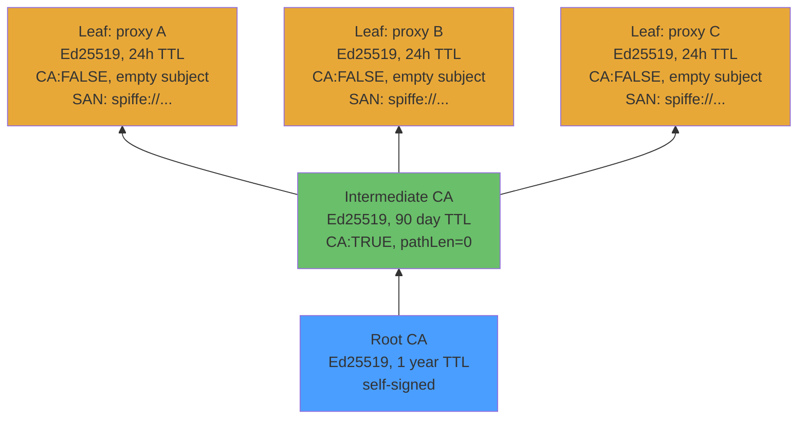

# Key Management

## Certificate Hierarchy



<hr />

## Certificate Structure (RFC 5280)

```
Certificate ::= SEQUENCE {
    tbsCertificate ::= SEQUENCE {
        version         [0] INTEGER 2         -- X.509 v3
        serialNumber         INTEGER          -- random 160 bits (RFC 5280 §4.1.2.2)
        signature            AlgorithmIdentifier  -- Ed25519
        issuer               Name             -- CN=interlink CA
        validity             SEQUENCE         -- 24h TTL
        subject              Name             -- EMPTY (§4.2.1.6)
        subjectPublicKeyInfo SubjectPublicKeyInfo
        extensions      [3]  Extensions {
            subjectAltName    [SAN] URI=spiffe://...
            keyUsage          [KU] digitalSignature
            extendedKeyUsage  [EKU] serverAuth, clientAuth
            basicConstraints  [BC] CA:FALSE
        }
    }
    signatureAlgorithm   AlgorithmIdentifier
    signatureValue       BIT STRING           -- Ed25519 signature
}
```

<hr />

## Key Rotation

| Key | Rotation | Mechanism |
|-----|----------|-----------|
| Root CA | configurable (default 1 year) | Manual ceremony, distribute new trust bundle |
| Intermediate CA | configurable (default 90 days) | Auto-renewal via identity agent |
| Leaf (proxy) | configurable (default 24 hours) | Auto-renewal via identity agent |

Short-lived leaf certs eliminate the need for CRLs or OCSP (RFC 5280 §6.3). Expiry IS revocation.

> **ADR-0002 trade-off:** interlink intentionally does not implement CRL/OCSP revocation today. Leaf certificates are short-lived (default 24 h) and issuance requires a trusted CA key. If a CA key is compromised, operators rotate the trust bundle out of band. This keeps the proxy simple and avoids runtime revocation network calls. See `lore/architecture-decisions.md` for details.
