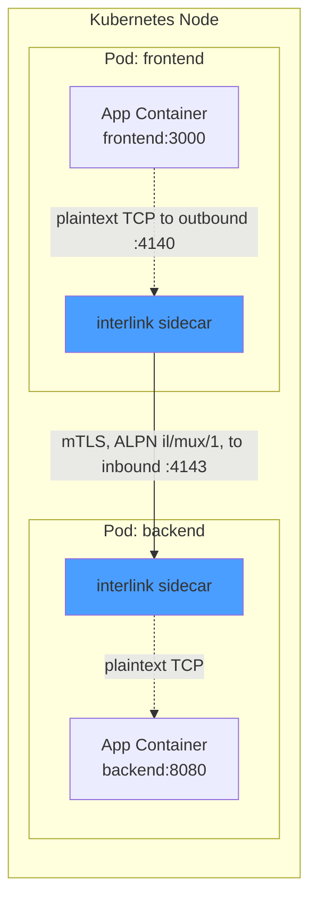
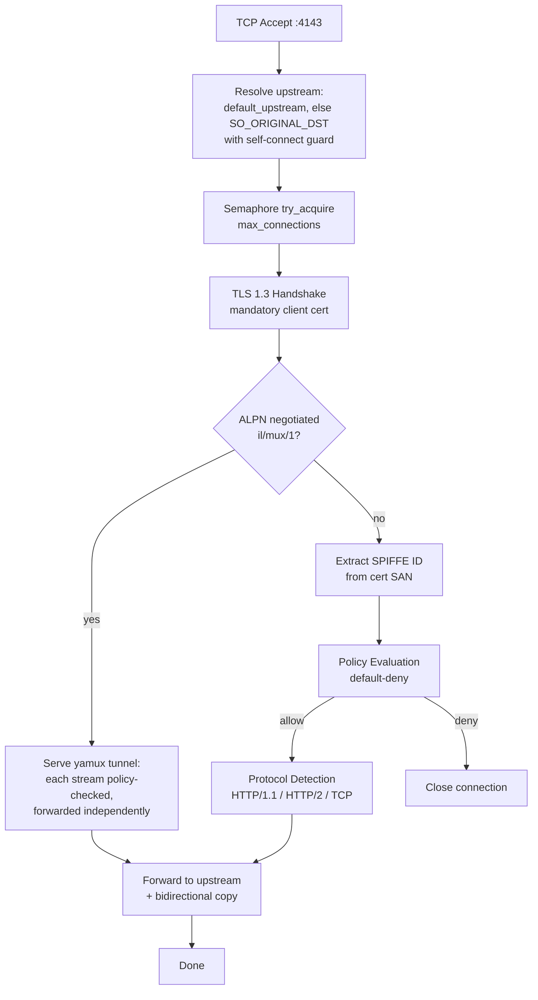
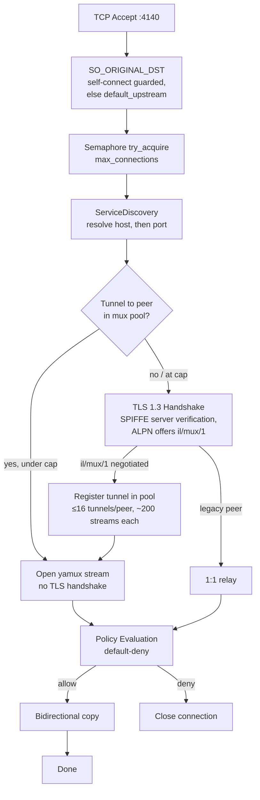

# Architecture Overview

## Deployment Topology

## Connection Lifecycle (Inbound)

## Connection Lifecycle (Outbound)

## Resource Budget

| Metric | Cloud Target | Edge/Smartphone Target |
|--------|-------------|----------------------|
| RSS memory | ≤20 MB active | ≤8 MB idle |
| CPU | ≤0.3 core active | ≤0.05 core idle |
| Binary size | ≤5 MB (stripped musl) | ≤5 MB |
| Startup time | ≤10 ms | ≤10 ms |
| Connections/sec | 10,000+ | 1,000+ |
